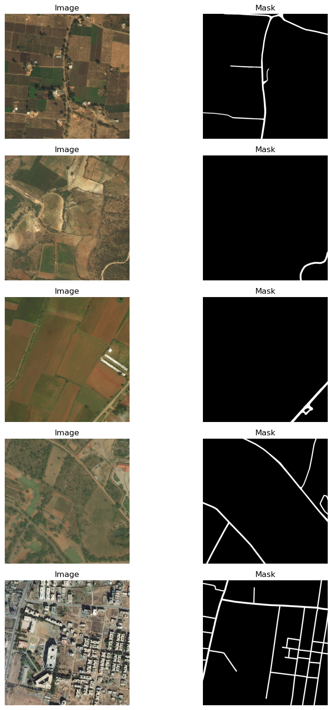
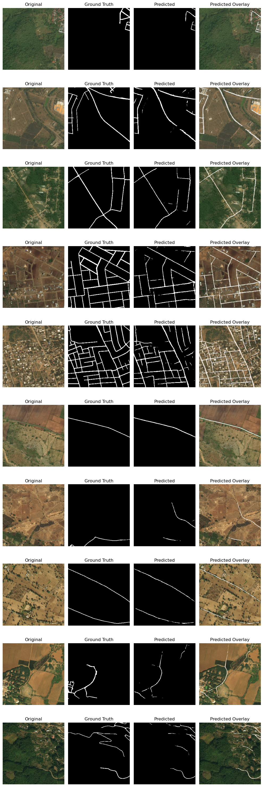

# Road Extraction from Satellite Images Using UNet 🛰️

Understanding a site's infrastructure and street connectivity is crucial for urban planners and land developers. Yet, accessing comprehensive road data remains a challenge, especially in underdeveloped regions.

This project aims to uncover the potential of extracting road surfaces from high-resolution satellite imagery. Using the UNet architecture and training on Deep Glove datasets resized to 256 by 256 pixels, the model showcases impressive capabilities in identifying road information, even with the reduced pixel dimensions. 

## Required packages
```
  numpy
  tensorflow
  keras
  opencv-python
  scikit-learn
  matplotlib
```

## Dataset
The **DeepGlobe 2018 Dataset** is a collection of satellite images designed for the DeepGlobe Challenge. It consists of high-resolution satellite imagery covering various regions of the Earth. The dataset is intended for tasks such as semantic segmentation and object detection in satellite images.




```
!pip install kaggle
!kaggle datasets download -d balraj98/deepglobe-road-extraction-dataset datasets
```


## Result

